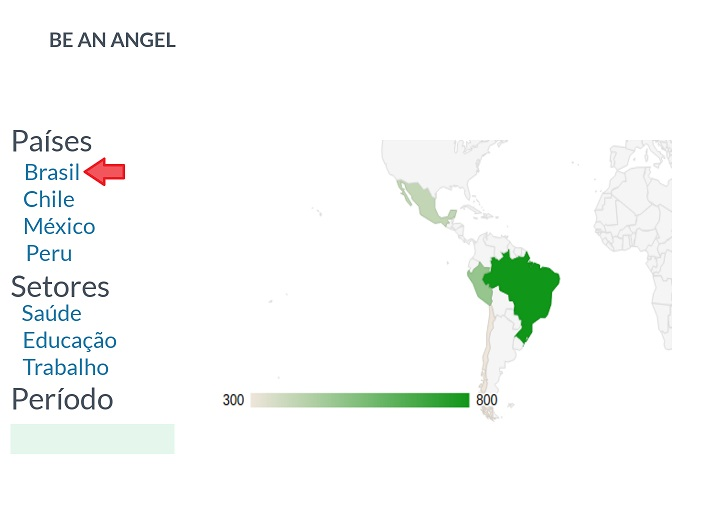
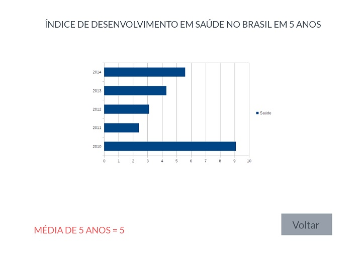
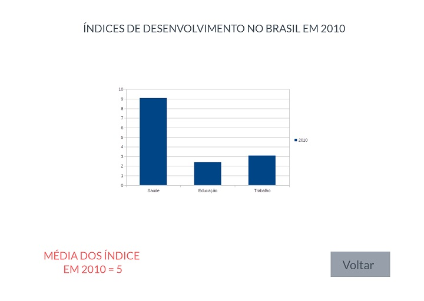
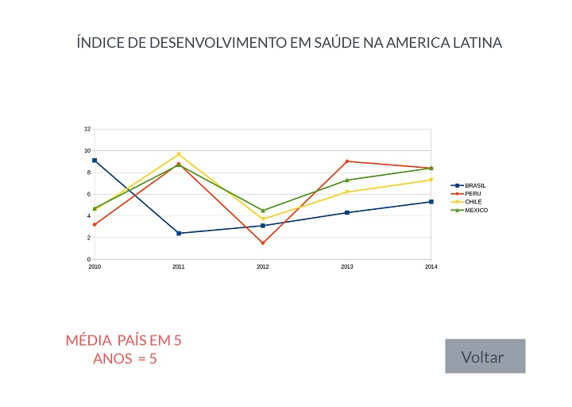
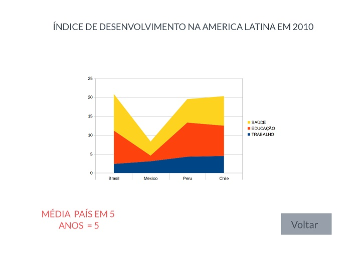

# Data Lovers

## Índice

* [Resumo](#resumo-do-projeto)
* [Definição](#definição-do-produto)
* [Protótipo](#desenho-da-interface-de-usuário)
* [Checklist](#checklist)

***

## Resumo do projeto

Neste projeto **desenvolvemos uma _página web_ para visualizar um
_conjunto (set) de dados_** que se adeque ao que seu usuário necessita.
Área de interesse escolhida:

* [Indicadores de desenvolvimento](src/data/worldbank/worldbank.json):
  Indicadores de desenvolvimento do Banco Mundial de alguns países (Brasil, Chile, México e Peru). Estes dados incluim indicadores

Com esses dados, criamos uma página web que permite **visualizar os dados,
filtrá-los e fazer algum cálculo agregado**. 

## Definição do produto

### Persona:
- Um grupo de invetidores que deseja investir em startups sociais no Brasil, Perú e Chile.

### Objetivo da persona:
- Investidores que possuem uma vasta carteira de investimento na América do Norte e Europa com investimentos em startups e iniciativas sociais.

### Solução do problema:
- Os investimentos serão realizados conforme os indicadores de desenvolvimento destes países. Foi solicitado pelo usuário uma aplicação web na qual seja possível analisar de forma comparativa entre os 3 países cada indicador e o valor de cada indicador nos anos de 2015 à 2017 em cada país.

A aplicação web desenvolvida permite que o usuário análise graficamente cada indicador 
da seguinte forma:

* Comparar valores do indicador no país selecionado nos anos de 2015 à 2017.
* Comparar valores do indicador nos países Brasil, Perú e Chile nos anos 2015 a 2017.
 
 [Acessar Aplicação pelo GitHub Pages](https://amanda-gomes.github.io/data-lovers/9)

## Desenho da interface de usuário

### Protótipo

- O protótipo foi desenvolvido utilizando o aplicativo Marvel:

[Protótipo Marvel](https://marvelapp.com/4f85cje/screen/53773929)

1. Primeiro gráfico:

2. Segundo gráfico:

3. Terceiro gráfico:

4. Quarto gráfico:

### Testes de usabilidade

- Ao realizar o teste de usabilidade, verificou-se que o modelo sugerido de filtro não atendia a necessidade do usuário, pois o banco de dados fornecido não continha as informações divididas por setores especificados no protótipo. A solução para entregar o resultado desejado ao usuário foi apresentar todos os indicadores sem a divisão de setores.

## Checklist

* [ ] Usamos VanillaJS.
* [ ] Incluimos _Definição de produto_ clara e informativa no `README.md`.
* [ ] Incluimos esboço da solução (protótipo de baixa fidelidade) no `README.md`.
* [ ] Incluimos a lista de problema detectados através dos testes de usabilidade
  no `README.md`.
* [ ] UI: Mostramos graficamente os valores dos indicadores.
* [ ] UI: Permite filtrar os dados com base em uma condição.
